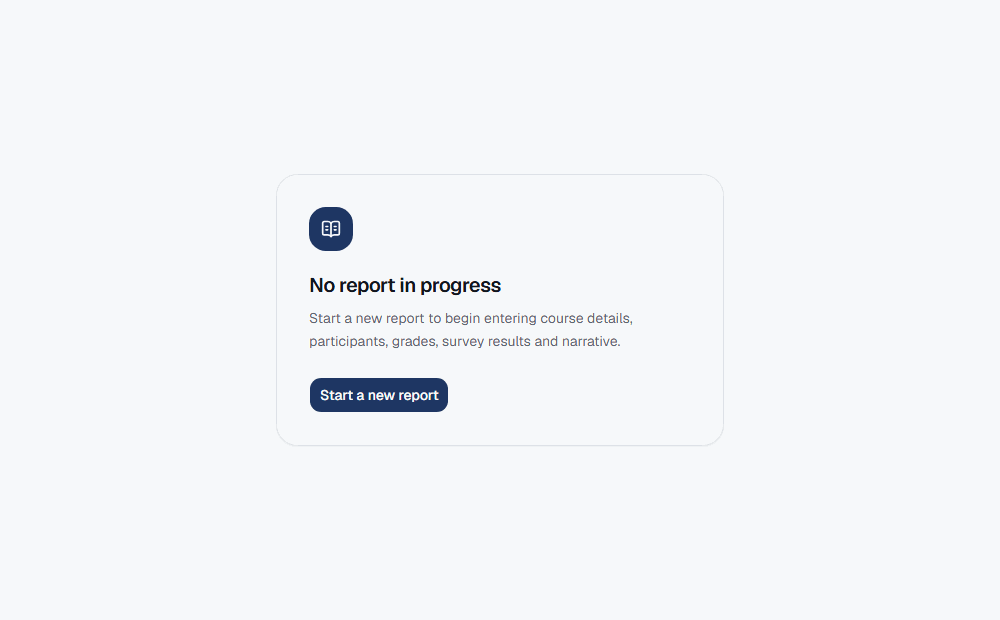

# Course Report Studio

Turns a course's attendance, grades and survey results into a finished
Arabic report package — Word, Excel and PowerPoint — that reads correctly
right-to-left on every machine that opens it.



---

## The problem

A training company finishes a course and owes the client a report. The data
arrives as a scanned attendance register, a spreadsheet of marks and a stack
of paper feedback forms. Someone spends a day retyping all of it into a Word
template, recalculating attendance percentages by hand, and then discovers on
delivery that the tables in the Word file read left-to-right.

That last failure is the expensive one, because it is invisible until a
client opens the document. Arabic RTL in Office files is not one setting — in
Word it is **six independent layers**, and a document with five of six looks
*almost* right.

This tool does the arithmetic once, in one place, and gets the RTL right by
asserting it in the produced bytes rather than trusting the code that wrote
them.

## What it does

- **Reads the attendance PDF** with a committed layout profile — locally,
  deterministically, no model involved in producing a single row.
- **Computes every derived figure once.** Attendance rates, weighted scores,
  pass/fail outcomes, survey averages, totals. The screen and the Word file
  render the same stored numbers, so they cannot disagree.
- **Gates delivery on a checklist.** Twelve rules; ten of them block.
- **Renders three documents** and writes them beside a `report-data.json`
  that accounts for where every number came from.
- **Reads in English or Arabic.** One switch flips every screen right-to-left,
  in place, without touching the draft. The report itself is Arabic either way.

## Try it

```bash
pnpm install
pnpm dev                       # http://localhost:3000
```

Then, to see a finished package without typing anything:

```bash
# seed the committed fixture and finalize it
curl -X PUT -H 'Content-Type: application/json' \
     --data-binary @fixtures/demo-draft.json http://localhost:3000/api/draft
curl -X POST http://localhost:3000/api/export
ls output/                     # 2026-…-al-jabal-al-akhdar-industries-…/
```

Or run the whole thing as a test:

```bash
pnpm test                      # 203 unit and component tests
pnpm test:e2e                  # empty draft → three files on disk
pnpm verify:rtl                # opens the produced documents, asserts the flags
```

## How it works

One draft file is the working state. Every screen edits it through a
debounced autosave; every write is validated against a Zod schema, recomputed
and then written atomically (temp file, rename) so an interrupted save cannot
corrupt it. Renderers are pure functions of `(draft, profile)` and produce
byte-identical output for identical input.

Export renders all three documents into memory *before* creating any
directory, and deletes the draft only once the package is safely on disk. A
renderer that throws leaves everything exactly as it was — the draft is the
only copy of hours of manual entry.

Diagrams and the reasoning: **[docs/architecture.md](docs/architecture.md)**.
The data model and its rules: **[docs/data-model.md](docs/data-model.md)**.

## 5. Agent architecture

Claude Code is wired into this repository to enforce invariants that code
alone cannot. `draft-store.ts` validates its own writes — but it is not the
only writer, since an agent can edit the draft file directly. Each hook
closes a gap of that shape.

Four hooks, deliberately using three different handler types, because the
type is chosen from what each must survive:

| Hook | Type | Does | Why that type |
|---|---|---|---|
| `PostToolUse` | **http** | Validates the draft after any edit; feeds the Zod error back as a `reason` | Reuses the app's own schema, so the check cannot drift from the thing it checks. No process start on the many edits that are not the draft. |
| `PreToolUse` | **command** | Refuses writes into `data/uploads/` | Must hold whether or not a dev server is running — uploads are irreplaceable |
| `Stop` | **agent** | Read-only audit of the draft's invariants | The checks are judgement calls, not assertions a script can make |
| `SessionStart` | **command** | Reports whether a draft exists and whether the server is up | States facts, issues no instructions |

The HTTP hook has a cost worth stating: **when the dev server is down it does
not validate**, which is exactly why the `SessionStart` hook reports whether
localhost:3000 is responding.

Two skills (`office-rtl`, `pdf-attendance`), two subagents (`report-auditor`,
`rtl-reviewer`) and two commands (`/adr`, `/fixture`) round it out. Every one
of them, with its boundary and the reasoning behind its handler type:
**[docs/agents.md](docs/agents.md)**.

## Right-to-left output

Every rule in [docs/rtl.md](docs/rtl.md) was added because something rendered
wrong. The catalogue is also packaged as a standalone skill,
[`office-rtl`](.claude/skills/office-rtl/SKILL.md), written to be lifted into
its own repository.

The single idea behind all of it: **set direction, never set the edge.**
"Right-aligned" and "right-to-left" are different claims; the first breaks the
moment a cell holds a Latin name or a number.

Because these bugs are invisible from the code, `pnpm verify:rtl` opens the
finished documents and asserts the flags — 34 checks across the three
formats, each with a negative control that strips the flag and asserts the
check then fails. A check nobody has watched fail is not evidence.

Credit for the Word layer model, including the `themeFontLang` master switch
that no document library writes by default, belongs to
[muhmoosa/claude-arabic-docs](https://github.com/muhmoosa/claude-arabic-docs).

## The privacy boundary

Extraction reads client rosters. The rule: **the model writes the extraction
profile; it never writes the data.** A model call that returns participant
rows is a bug.

A profile describes *layout* — where the name column sits, how a tick is
spelled — so it can be committed, reviewed in a pull request and shown in a
demo. The rows are produced locally by deterministic code. The fallback that
asks a model to propose a profile is off by default, requires explicit
per-use consent, and shows the operator the literal payload first; every
substantive cell is replaced before it is sent, and even header digits are
masked so session dates never leave.

Reasoning and enforcement:
**[ADR 0011](docs/adr/0011-privacy-boundary.md)**.

## Layout

```
app/            routes and the six editing screens
src/lib/        schema · compute · draft-store · pdf pipeline · i18n
src/render/     docx · xlsx · pptx  (pure, deterministic)
scripts/        verify-rtl · fixture generators · demo recorder
.claude/        hooks · skills · agents · commands
docs/           architecture · data-model · rtl · agents · runbook · adr/
fixtures/       demo draft, sample register, its extraction profile
```

| Command | |
|---|---|
| `pnpm dev` | run the app |
| `pnpm test` | unit and component tests |
| `pnpm test:e2e` | full run in a browser |
| `pnpm verify:rtl` | assert RTL flags in produced documents |
| `pnpm fixture` | regenerate the demo draft |
| `pnpm demo:gif` | re-record the GIF above |

## Decisions

Architecture decisions live in [docs/adr/](docs/adr/), in MADR form. Each one
lists the options rejected and why — that is the point of the file.

The load-bearing ones:
[0006](docs/adr/0006-model-writes-the-extraction-profile-not-the-data.md)
(the model writes the profile, not the data) ·
[0007](docs/adr/0007-http-hook-for-draft-validation.md)
(HTTP hook over command hook) ·
[0011](docs/adr/0011-privacy-boundary.md) (what may leave the machine) ·
[0012](docs/adr/0012-ui-locale-in-a-cookie-not-the-url.md) (the UI language
lives in a cookie).

## Status and limits

Working end to end: manual entry, PDF extraction, all three renderers, the
finalize gate, and the agent surface.

Known limits, stated plainly:

- **The Office files have not been opened by a human.** The RTL flags are
  asserted in the bytes; whether they *look* right in Word on macOS is
  unverified. That is the next thing to check, not something to assume.
- **The extraction fallback's network call is untested** — there are no API
  credentials in this environment. Everything either side of it is covered,
  including a round trip proving a proposed profile reproduces the committed
  table exactly.
- **The data model is derived, not transcribed.** The source PRD was not
  available; `docs/data-model.md` ends with a table of every assumption made
  and what changes if it is wrong.
- ADRs 0001–0005 are absent for the same reason.
