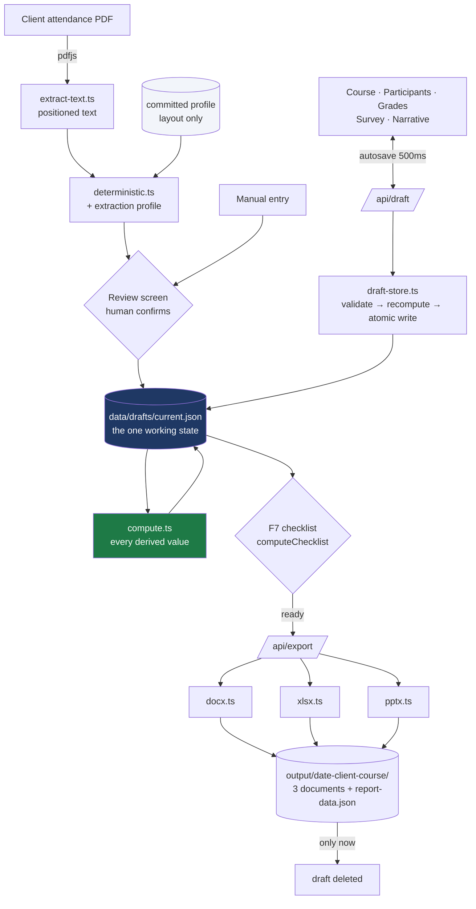
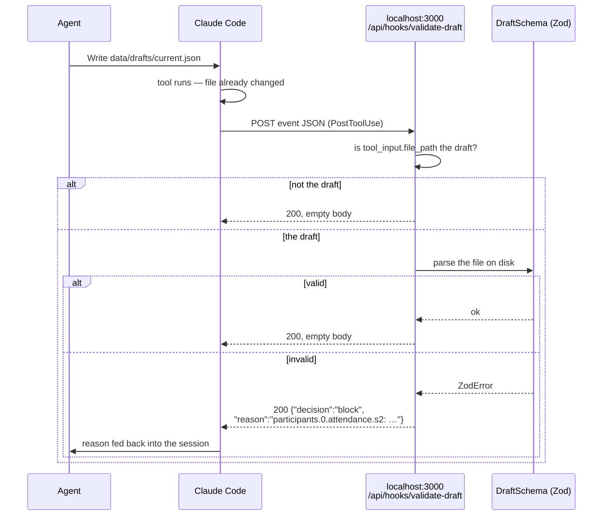

# Architecture

Two diagrams and the reasoning around them. Everything else is in the code.

## Data flow

One draft file is the working state. Every screen edits it, every renderer
reads it, and one function computes every derived number in it.

Three properties this shape buys:

**Computation has one home.** `compute.ts` produces every attendance rate,
score and outcome, and stores them in the draft. The UI renders what it finds
there; the renderers write what they find there. A figure on screen and the
same figure in the Word file are the same bytes, so they cannot disagree.

**The draft is never half-written.** `draft-store.ts` validates against the
Zod schema, recomputes, writes a temp file and renames it over the target.
The editor autosaves every 500ms, so it *will* be interrupted mid-write; the
rename is what makes that safe.

**Export is all-or-nothing.** All three documents render into memory before
any directory is created, and the draft is deleted only once the package is
on disk. A renderer that throws leaves the draft exactly as it was — it is
the only copy of hours of manual entry.

## The hook loop

`draft-store.ts` guards its own writes, but it is not the only writer: an
agent working in this repository can edit `current.json` directly, and that
path bypasses the store. The `PostToolUse` hook closes it.

Two details of the contract shape this, and both are easy to get wrong.
**An HTTP hook cannot block with a status code** — a non-2xx is treated as a
non-blocking error and the decision is discarded, so every path returns 200,
including the failures. And **`PostToolUse` has no `permissionDecision`**;
that field belongs to `PreToolUse`, which runs before the tool. The blocking
shape here is `{"decision":"block","reason":"…"}`.

The route reads the draft by its own resolved path rather than the one in the
request, so the endpoint is not a "read any file the caller names" primitive.

Why HTTP rather than a command hook: the route imports the same
`DraftSchema` the app uses, so the check cannot drift from the thing it is
checking, and no process starts on the overwhelming majority of edits that
have nothing to do with the draft. The cost, stated plainly, is that the
check is inert when the dev server is down — which is why the `SessionStart`
hook reports whether localhost:3000 is responding. Full reasoning in
[ADR 0007](adr/0007-http-hook-for-draft-validation.md).

`PreToolUse` protection of `data/uploads/` uses a **command** hook instead,
precisely because it must hold whether or not a server is running. The two
hooks use different handler types for opposite reasons; see
[docs/agents.md](agents.md).
