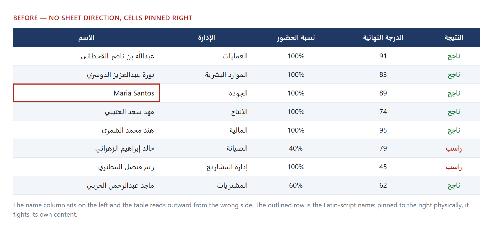
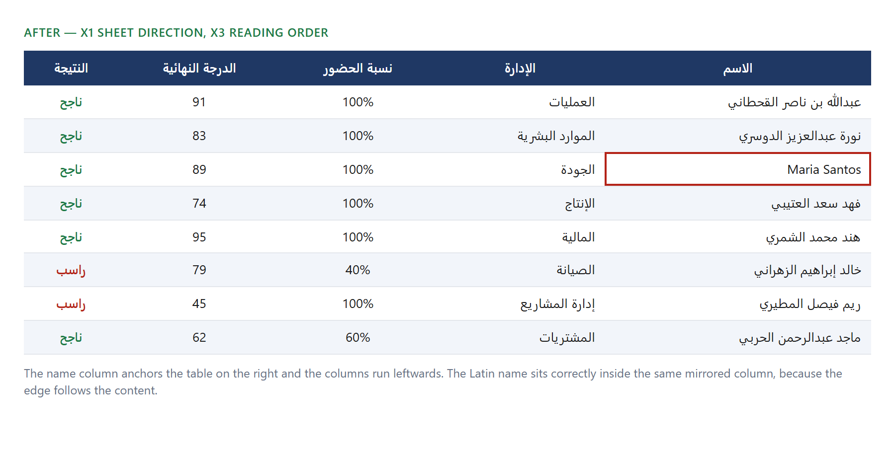

# Right-to-left output

Every rule in this document was added because something rendered wrong.
None of them are precautionary. Each is written as: the rule, the symptom it
fixes, and why the obvious alternative fails.

The thing that makes RTL bugs expensive is that they are **invisible from the
code**. A renderer can set every flag on its objects, pass every test about
its data, and still produce a file that opens with the columns backwards —
because the flag never reached the XML, or reached one sheet and not the
others. So the rules below are paired with `scripts/verify-rtl.ts`, which
opens the finished bytes and asserts the flags are really there.

Run it with `pnpm verify:rtl`. It exits non-zero on a missing flag.

## What the rules do, seen

**These are not screenshots of Excel.** Nothing in this environment can open
an `.xlsx`, and pretending otherwise would be the exact kind of claim this
document exists to avoid. The sheet below is reproduced in a browser from the
same fixture data the renderer uses, with and without the two rules under
discussion — X1 (sheet direction) and X3 (reading order rather than physical
alignment). Regenerate with `pnpm docs:images`.

The real change is the XML, and that is quoted underneath.

**Before** — no sheet direction; cells pinned physically to the right:



**After** — `rightToLeft` on the sheet view, `readingOrder` on the cells:



Two things changed. The name column moved from the left edge to the right and
the columns now run leftwards — that is X1, and it is the whole sheet, not a
per-cell setting. And the outlined row, the Latin-script participant name,
now sits correctly *inside* the mirrored column instead of fighting a
hard-coded right alignment — that is X3.

In the produced workbook the difference is one attribute per sheet:

```diff
  <worksheet …>
    <sheetViews>
-     <sheetView workbookViewId="0">
+     <sheetView workbookViewId="0" rightToLeft="1">
        <pane xSplit="1" ySplit="1" topLeftCell="B2" state="frozen"/>
      </sheetView>
    </sheetViews>
```

One attribute, five sheets, and no way to see it in a code review. Which is
the argument for `pnpm verify:rtl`.

## The one idea behind all of it

**Set direction, then let the renderer decide the edge. Never set the edge
yourself.**

"Right-aligned" and "right-to-left" are different claims. The first is
physical and is wrong the moment a cell holds a Latin name or a number. The
second is logical and stays correct for any content. Nearly every rule below
is an instance of that distinction.

---

## Excel (`src/render/xlsx.ts`)

### X1 — `rightToLeft: true` on every sheet's view

```ts
sheet.views = [{ state: "frozen", xSplit: 1, ySplit: 1, rightToLeft: true }];
```

**Symptom without it:** the sheet opens with column A at the left edge.
Arabic headers read outward from the wrong side, and the participant name
column — which should anchor the table on the right — sits on the left with
the session columns running away from it in the wrong direction.

**Why every sheet, not the workbook:** there is no workbook-level setting.
`rightToLeft` is an attribute of `<sheetView>`, and each worksheet has its
own. Setting it while building sheet 1 and forgetting sheet 4 produces a file
that looks fine until someone clicks the fourth tab. This is the single most
likely RTL regression in this codebase, which is why the verifier checks
every sheet independently and reports them by name.

### X2 — Do **not** also reverse the column order

This is the rule most likely to be "fixed" into a bug.

`rightToLeft` **is** the mirroring. Excel renders column A at the right edge
and runs leftwards. So columns are written in ordinary logical order — name
first, then session 1, session 2, and so on — and they display right-to-left
correctly.

**Symptom if you reverse the array as well:** the sheet is mirrored twice
and lands back where it started. The name column ends up on the left, the
sessions ascend leftwards, and the natural next move is to add a third flip
somewhere. If the columns look backwards, check that something is not
already flipping them.

### X3 — Reading order on cells, not physical alignment

```ts
cell.alignment = { readingOrder: "rtl", vertical: "middle" }; // no `horizontal`
```

**Symptom without it:** with `horizontal: "right"` hard-coded, an Arabic
column looks correct — until the row holding `Maria Santos` renders its
Latin name jammed against the right edge with its trailing punctuation
misplaced, because the physical setting is fighting the content.

Leaving `horizontal` unset means Excel uses `general` alignment, which
resolves the edge from the cell's reading order and the text itself. Arabic
goes right, Latin goes left, both inside the same mirrored column. This is
the spreadsheet form of the "logical start/end, not left/right" rule that
Word needs (see R-series, M4).

### X4 — Numbers are always `readingOrder: "ltr"`

```ts
cell.alignment = { horizontal: "center", readingOrder: "ltr" };
```

**Symptom without it:** digit strings adjacent to Arabic text can reorder.
Numerals read left-to-right even inside Arabic documents; a percentage is
not prose and should never inherit the paragraph direction. Centring is
direction-neutral and safe, so numeric columns are centred explicitly.

### X5 — An unanswered question is text, not zero

A survey question nobody answered has an average of `null`, and the workbook
writes the words "لا توجد ردود" into that cell rather than a `0`.

**Symptom without it:** zero is a rating the scale cannot express. Writing it
into a numeric column drags every chart and every average built on that sheet
toward the floor, and reports a bottom score for a question that was simply
never asked. This is not strictly an RTL rule — it is here because it is the
same class of mistake: a value that is technically renderable but semantically
false.

### X6 — Fonts are set explicitly, per run

Arabic cells get `profile.fonts.arabic`; numeric cells get
`profile.fonts.latin`. Neither is left to the default.

**Symptom without it:** the file renders in whatever font the reader's copy
of Excel falls back to for Arabic, which differs between Windows and macOS
and between Office versions. Two people open the same file and see different
documents, and neither can reproduce the other's complaint.

Excel has one font slot per run, so this is simply "choose the right font per
cell". Word is harder — it has a separate *complex script* slot, and setting
only the Latin one is the classic silent failure. That rule arrives in M4.

### X7 — Frozen headers

Not an RTL rule, but the verifier checks it (`X2 frozen header row` in the
output) for the same reason: it is invisible from the code and only
observable in the produced file. `xSplit: 1` pins the name column, which on a
mirrored sheet is the rightmost one — another place where the logical index
and the physical position deliberately differ.

---

## Word (`src/render/docx.ts`)

Word RTL is **six independent layers**, not one flag. A document with five of
six looks *almost* right, which is worse than obviously broken — nobody
notices until a client does.

The layer model, the `themeFontLang` master switch and the Word-for-Mac
alignment rule are adapted from
[muhmoosa/claude-arabic-docs](https://github.com/muhmoosa/claude-arabic-docs),
an Arabic RTL hardening skill for `python-docx`. The code does not transfer to
the `docx` npm package; the rule catalogue does, and it saved a great deal of
discovery. Credit belongs there.

| Layer | Where | What | Verifier |
| --- | --- | --- | --- |
| 0.0 | `word/settings.xml` | `<w:themeFontLang w:bidi="ar-SA"/>` | D1 |
| 0 | docDefaults `rPr` | `<w:lang w:bidi="ar-SA"/>` | D2 |
| 0.5 | docDefaults `pPr` | `<w:bidi/>` + `<w:jc w:val="start"/>` | D3 |
| 1 | `<w:sectPr>` | `<w:bidi/>` before `<w:docGrid>` | D4, D5 |
| 2 | `<w:tblPr>` | `<w:bidiVisual/>` | D6 |
| 3 | `<w:pPr>` / `<w:rPr>` | `<w:bidi/>` / `<w:rtl/>` | D7, D8 |
| — | runs | `w:cs` font + `w:szCs` size | D9 |
| 5 | `<w:jc>` | `start`/`end`, never `left`/`right` | D10 |

### R1 — `themeFontLang` is the master switch

**Symptom without it:** everything else is decoration. Word does not enable
its bidi pipeline at all, and paragraphs render left-aligned no matter how
many other flags are set.

**Why it is easy to miss:** no document-generation library writes it. Only a
live Word session populates it, from the OS keyboard layout — so a file a
human made in Word works, yours does not, and the XML looks identical
everywhere you thought to look.

### R2 — Three layers have no API in `docx` 9.7.1

`visuallyRightToLeft`, `bidirectional`, `rightToLeft`, `AlignmentType.START`,
`font.cs` and `sizeComplexScript` all exist. These three do not:

- **layer 1** — `ISectionPropertiesOptionsBase` has no `bidi` field
- **layer 0.5** — `IParagraphStylePropertiesOptions` has no `bidirectional`
- **layer 0.0** — nothing writes `settings.xml`

`hardenRtl()` in `src/render/docx.ts` unzips the finished package, patches the
XML and re-zips. Two ordering constraints, both of which make Word report the
file as *corrupt* rather than merely wrong:

- `<w:bidi/>` before `<w:docGrid>` inside `<w:sectPr>`
- `<w:bidi/>` before `<w:jc>` inside `<w:pPr>`

### R3 — Complex-script font *and* size

Word keeps two font slots and two size slots per run. `w:cs` is the one it
uses for Arabic, and `w:szCs` is the size it uses for it.

**Symptom without `w:cs`:** Arabic falls back to whatever the reader's machine
picks, so the same file looks different on Windows and macOS.
**Symptom without `w:szCs`:** the Arabic renders at the default size while the
Latin text obeys the size you set.

### R4 — Logical alignment, the Word-for-Mac trap

`w:jc="start"` / `"end"`, never `left` / `right`.

**Symptom:** correct on Windows, wrong on macOS. Word for Mac reinterprets
physical alignment under RTL, so pinning a paragraph `right` — the obvious fix
when Arabic looks left-aligned — resolves to the wrong side on one platform.
Only cross-platform testing finds this, which is why the verifier fails the
build on any physical `w:jc`.

### R5 — Direction is chosen per value, not per column

The roster holds `عبدالسلام محمد الفيتوري` and `Maria Santos` in one column.
`auto()` picks the run type from the content.

**Symptom if everything is marked RTL:** the Latin name renders reversed
against its punctuation inside the mirrored table.

### R6 — Long digit strings get their own LTR run

`splitRuns()` breaks prose at Latin/digit boundaries and marks each part
explicitly.

**Symptom without it:** the contract number `20260208114500` planted in the
fixture's conclusion reorders. Word's bidi algorithm handles mixed *words*
well; long digit sequences beside Arabic punctuation are where it fails
visibly.

### R7 — Do not reverse rows to "fix" a table

`<w:bidiVisual/>` mirrors the column order. Rows are built in logical order —
first column first — exactly as in Excel (X2). Reversing the arrays as well
flips it back.

### Digit shape

Arabic-Indic numerals (٠–٩) are deliberately **not** used. The report is full
of scores, percentages and dates that get checked against a source
spreadsheet, and converting them makes that harder. If a client asks, it
belongs in `RenderProfile` as an option, never as a default.

## PowerPoint (`src/render/pptx.ts`)

PowerPoint inverts the rule that governs Excel and Word, which is why it gets
its own warning rather than a footnote.

### P1 — `rtlMode` on every Arabic text body

`rtlMode: true` writes `<a:pPr rtl="1">`. Applied through the shared
`arText()` helper so no slide can quietly omit it.

**Symptom without it:** Arabic paragraphs render left-to-right with their
punctuation on the wrong end, on an otherwise correct-looking slide.

### P2 — Charts must be **reversed by hand**. This is the opposite of X2/R7.

In Excel, `rightToLeft` mirrors the columns. In Word, `<w:bidiVisual/>`
mirrors the table. In both, the renderer does the flipping and reversing your
arrays as well is the classic double-flip bug.

**A chart has no such flag.** There is no bidi attribute anywhere in
`chartN.xml` that reorders categories, so an Arabic bar chart puts its first
category on the left unless the *data* is reversed. `rtlCategories()` reverses
labels and values together — reversing one without the other silently
mislabels every bar, which is the worst kind of wrong because the chart still
looks plausible.

So: **do not reverse for Excel or Word; do reverse for charts.** The
distinguishing question is whether the format offers a mirroring flag.

### P3 — Chart text needs `rtl="1"` injected

pptxgenjs writes `<a:pPr>` inside a chart's `<c:txPr>` with no `rtl`
attribute and exposes no option to set one.

**Symptom:** a deck whose slides are perfectly RTL still renders every axis
label, legend entry and data label left-to-right. `hardenPptxRtl()` adds the
attribute to chart parts after packing, and D-series-style verifier rule P3
asserts it.

### P4 — Native charts, not pictures

`ppt/charts/chartN.xml` parts, no `ppt/media/`. A chart rendered as an image
cannot be selected, re-themed or corrected by the person receiving the deck,
and its text is invisible to the RTL rules entirely. The verifier fails a deck
that has no chart parts.

### P5 — Reproducibility needs two extra steps here

pptxgenjs numbers chart and embedded-workbook parts from a **module-level
counter**, so the second deck rendered in a process gets `chart5.xml` where
the first got `chart1.xml` — part names that depend on process history rather
than input. `normalizeChartNumbering()` renumbers them from 1 and rewrites
every reference.

Each native chart also carries a complete embedded `.xlsx` (what PowerPoint
opens behind "Edit Data"), with its own timestamps, so those nested packages
are re-stamped and re-zipped too. Without both steps the deck is reproducible
everywhere except four nested zips and a set of part names.

---

## Verifying

`scripts/verify-rtl.ts` reads a finished document and asserts its flags.

```bash
pnpm verify:rtl                 # renders the committed fixture and checks it
pnpm verify:rtl path/to/file.xlsx
```

Two design points worth keeping as it grows:

**A report with zero checks is a failure, not a pass.** `reportPassed()`
requires `checks > 0`. Otherwise a verifier that silently stopped finding
worksheets would report success on every file, which is the worst possible
failure for a tool whose entire job is catching silence.

**The checks have negative controls.** `src/render/xlsx.test.ts` and
`src/render/docx.test.ts` take a real document, strip one flag out of the
XML, re-zip it, and assert that verification then fails — including the cases
where only *one* sheet or *one* table loses it. There is one such test per
Word layer. A check that has never been observed to fail is not evidence.

**Output is reproducible.** Both renderers take their timestamps from
`draft.updatedAt` rather than the clock, and the docx post-processor pins the
zip mtimes, so two renders of one draft are byte-identical and a test can
assert it. The zip format only accepts 1980-2099, so the Unix epoch is
rejected as an mtime.

## Extracting this

`.claude/skills/office-rtl/SKILL.md` holds the same rules written for someone
who has never seen this project, and is intended to become its own repository.
When a rule changes, change it in both.
